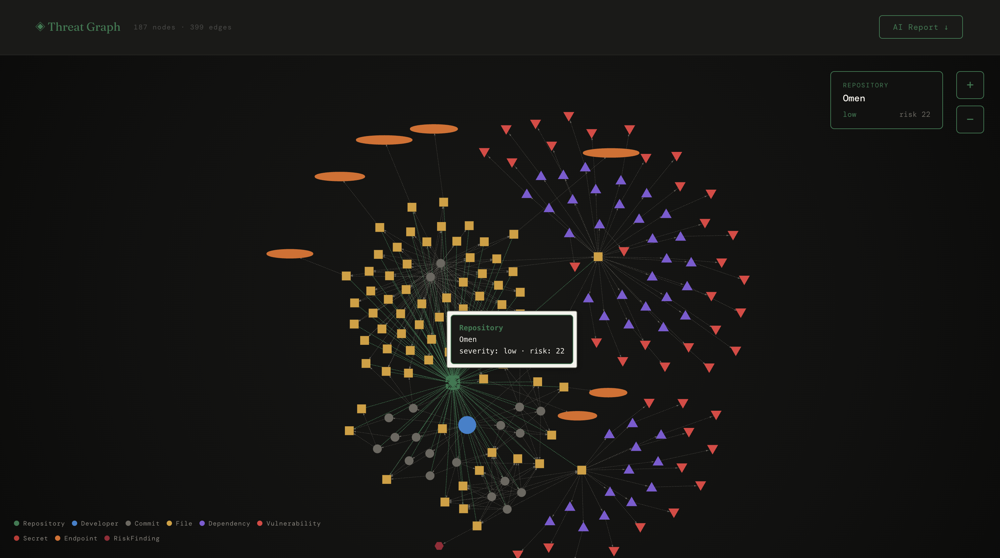
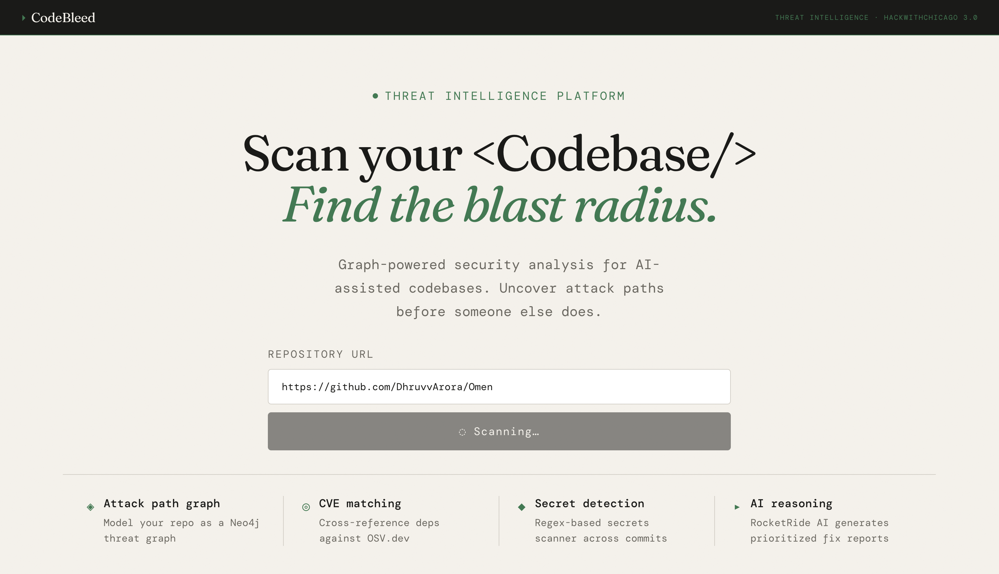
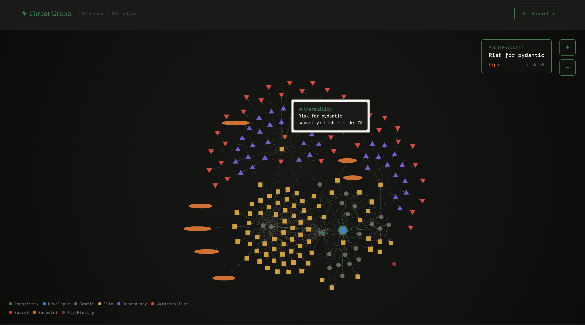

# Omen

**Omen** is a graph-based security analysis platform for codebases. It scans a repository, models it as a Neo4j threat graph, and surfaces connected attack paths that point-in-time scanners miss.

Most scanners answer *"what vulnerabilities exist?"* and hand you a flat list ranked by severity. That list says nothing about whether a finding is reachable. Omen answers *"how do these issues connect into an actual attack route?"* by making the relationships between code, dependencies, secrets, and exposed endpoints queryable.



*A scanned repository as a threat graph: 187 nodes, 399 edges across files, commits, dependencies, vulnerabilities, secrets, and endpoints.*

---

## Why graph-based analysis

In fast-moving development environments, especially with AI-assisted coding, repositories grow quickly and security review becomes reactive.

Most tools flag isolated issues: exposed secrets, vulnerable dependencies, insecure endpoints, risky commits. But real-world compromise usually happens through **connected weaknesses**, not isolated ones. A medium-severity CVE on an internet-facing path matters more than a critical one buried behind three internal services, and a flat severity list cannot express that difference.

Omen models the repository as a knowledge graph so those relationships become traversable.

---

## By the numbers

The problem is not theoretical. It is visible in how modern software is being written and where risk is showing up:

- **46% of code** in files where GitHub Copilot was enabled was completed by Copilot; in Java, **61%**.[^1]
- **97% of surveyed developers** reported having used AI coding tools at work.[^2]
- **39 million+ secrets** were leaked across GitHub in **2024 alone**.[^3]
- **45% of AI-generated code tasks** tested by Veracode introduced a known security flaw; in its Spring 2026 update, secure completion was still only **55%**.[^4][^5]
- Georgetown CSET found that **almost half** of code snippets produced by five LLMs contained bugs that could lead to malicious exploitation.[^6]
- A USENIX study on package hallucinations found rates of **5.2% for commercial models** and **21.7% for open-source models**, including **205,474 unique hallucinated package names**.[^7]
- A 2026 large-scale study of AI-authored commits identified **484,606 introduced issues** across **3,841 repositories**, from **304,362 verified AI-authored commits**.[^8]

When AI-assisted development increases code volume, dependency sprawl, and review pressure, security issues stop being single findings and start becoming connected attack paths.

---

## Graph schema

Omen models a repository using **9 node types**:

| Node | Represents |
| --- | --- |
| `Repository` | The scanned codebase root |
| `Developer` | Commit authors and contributors |
| `Commit` | Individual commits and their metadata |
| `File` | Source files within the repository |
| `Dependency` | Third-party packages and versions |
| `Vulnerability` | CVEs and known package advisories |
| `Secret` | Detected credentials, tokens, and keys |
| `Endpoint` | Exposed or externally reachable surfaces |
| `RiskFinding` | Derived findings from graph analysis |

Relationships connect these into traversable paths, so a query can move from an exposed endpoint through the file that serves it, to the dependency it pulls in, to the CVE affecting that dependency.

---

## What it does

- Scans a GitHub repository or local codebase
- Extracts security-relevant entities: secrets, dependencies, endpoints, commit history
- Enriches dependency findings against public vulnerability data (OSV.dev)
- Assembles everything into a Neo4j graph
- Traverses the graph to identify attack paths and blast radius
- Layers AI reasoning over graph query output to produce prioritized, plain-language reports
- Visualizes the full graph interactively



---

## Severity and risk scoring

Findings carry both a severity classification and a numeric risk score derived from graph context, not from CVSS alone. A dependency vulnerability that sits on a reachable path scores higher than an equivalent one that does not.



*A high-severity dependency vulnerability surfaced with its risk score in graph context.*

---

## Architecture

```
             +----------------------+
             |   GitHub / Local     |
             |     Repository       |
             +----------+-----------+
                        |
                        v
             +----------------------+
             |  Ingestion Pipeline  |
             +----------+-----------+
                        |
                        v
             +----------------------+
             | Security Extraction  |
             | secrets / deps / API |
             +----------+-----------+
                        |
                        v
             +----------------------+
             |   Graph Assembly     |
             |       Neo4j          |
             +----------+-----------+
                        |
          +-------------+-------------+
          |                           |
          v                           v
+----------------------+   +----------------------+
|  Attack Path Logic   |   |   AI Prioritization  |
+----------+-----------+   +----------+-----------+
           \                         /
            \                       /
             v                     v
              +-------------------+
              |   Frontend Graph  |
              | Visualization UI  |
              +-------------------+
```

The backend degrades gracefully: if the AI reasoning layer is unavailable, the API falls back to technical graph output rather than failing the request, so the frontend always renders.

---

## Tech stack

**Frontend:** React, TypeScript, Vite, graph visualization layer
**Backend:** Python, FastAPI, Uvicorn, Pydantic v2 schemas
**Graph:** Neo4j
**Intelligence:** repository parsing pipeline, OSV.dev vulnerability enrichment, LLM reasoning layer

Frontend and backend are developed against strict shared JSON contracts, which lets both sides move in parallel without integration drift.

---

## Project structure

```
Omen/
├── frontend/      # UI for scan submission, results, and graph visualization
├── backend/       # FastAPI services, scanning pipeline, graph logic, APIs
└── README.md
```

---

## Setup

### 1. Clone

```bash
git clone https://github.com/DhruvvArora/Omen.git
cd Omen
```

### 2. Backend

```bash
cd backend
python -m venv venv
source venv/bin/activate
pip install -r requirements.txt
uvicorn main:app --reload --port 8000
```

### 3. Frontend

```bash
cd ../frontend
npm install
npm run dev
```

### 4. Neo4j

Run via Neo4j Desktop, Neo4j Aura, or Docker. The backend reaches it through environment variables.

### Environment variables

Create a `.env` in `backend/`:

```
GITHUB_TOKEN=your_github_token
NEO4J_URI=bolt://localhost:7687
NEO4J_USERNAME=neo4j
NEO4J_PASSWORD=your_password
AI_API_KEY=your_model_api_key
```

`GITHUB_TOKEN` is strongly recommended to avoid GitHub rate limits.

---

## How a scan works

1. User submits a repository URL or local path
2. Backend ingests the codebase and collects file, commit, and dependency metadata
3. Extraction services scan for secrets, vulnerable dependencies, and exposed endpoints
4. Findings become graph nodes and edges in Neo4j
5. Traversal logic identifies attack paths across connected findings
6. The AI layer summarizes and prioritizes what matters most
7. The frontend renders the graph, the findings, and the report

---

## Status

Omen is an active prototype. The scanning pipeline, graph assembly, traversal, and visualization are working end to end. Current work is on the remediation side: fix simulation, secure refactor suggestions, and sharper risk ranking.

Planned next:

- Stronger secret scanning heuristics
- Richer CVE mapping and dependency intelligence
- Better attack path ranking
- Historical commit risk analysis
- Async scan pipelines with status polling
- Exportable reports

---

## References

[^1]: GitHub, [*How companies are boosting productivity with generative AI*](https://github.blog/ai-and-ml/generative-ai/how-companies-are-boosting-productivity-with-generative-ai/) (May 2023).
[^2]: GitHub, [*Survey: The AI wave continues to grow on software development teams*](https://github.blog/news-insights/research/survey-ai-wave-grows/) (Aug 2024).
[^3]: GitHub, [*GitHub found 39M secret leaks in 2024*](https://github.blog/security/application-security/next-evolution-github-advanced-security/) (Apr 2025).
[^4]: Veracode, [*We Asked 100+ AI Models to Write Code*](https://www.veracode.com/blog/genai-code-security-report/) (Jul 2025).
[^5]: Veracode, [*Spring 2026 GenAI Code Security Update*](https://www.veracode.com/blog/spring-2026-genai-code-security/) (Mar 2026).
[^6]: Georgetown CSET, [*Cybersecurity Risks of AI-Generated Code*](https://cset.georgetown.edu/publication/cybersecurity-risks-of-ai-generated-code/) (2024).
[^7]: Spracklen et al., [*A Comprehensive Analysis of Package Hallucinations by Code Generating LLMs*](https://arxiv.org/abs/2406.10279) (USENIX Security 2025).
[^8]: [*Debt Behind the AI Boom: A Large-Scale Empirical Study of AI-Generated Code in the Wild*](https://arxiv.org/html/2603.28592v1) (Mar 2026).
